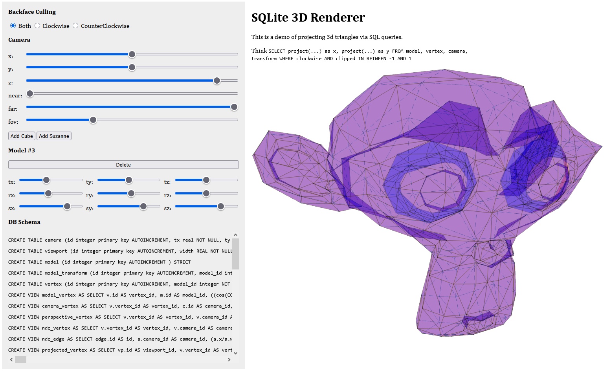

# SQLite 3D Renderer



---

[Live Demo](https://static.laszlokorte.de/sql3d/)

This is a demo of projecting 3d triangles via SQL queries.

Think of <code>SELECT project(...) as x, project(...) as y FROM model, vertex, camera, transform WHERE clockwise AND clipped IN BETWEEN -1 AND 1</code>

## SQL Schema

```sql
CREATE TABLE camera (
	id INTEGER PRIMARY KEY AUTOINCREMENT
	,tx REAL NOT NULL
	,ty REAL NOT NULL
	,tz REAL NOT NULL
	,near REAL NOT NULL
	,far REAL NOT NULL
	,fov REAL NOT NULL
	,aspect REAL NOT NULL
	) STRICT

CREATE TABLE viewport (
	id INTEGER PRIMARY KEY AUTOINCREMENT
	,width REAL NOT NULL
	,height REAL NOT NULL
	,camera_id INTEGER NOT NULL REFERENCES camera(id) ON DELETE CASCADE
	) STRICT

CREATE TABLE model (id INTEGER PRIMARY KEY AUTOINCREMENT) STRICT

CREATE TABLE model_transform (
	id INTEGER PRIMARY KEY AUTOINCREMENT
	,model_id INTEGER NOT NULL UNIQUE REFERENCES model(id) ON DELETE CASCADE
	,tx REAL NOT NULL DEFAULT 0.0
	,ty REAL NOT NULL DEFAULT 0.0
	,tz REAL NOT NULL DEFAULT 0.0
	,rx REAL NOT NULL DEFAULT 0.0
	,ry REAL NOT NULL DEFAULT 0.0
	,rz REAL NOT NULL DEFAULT 0.0
	,sx REAL NOT NULL DEFAULT 1.0
	,sy REAL NOT NULL DEFAULT 1.0
	,sz REAL NOT NULL DEFAULT 1.0
	) STRICT

CREATE TABLE vertex (
	id INTEGER PRIMARY KEY AUTOINCREMENT
	,model_id INTEGER NOT NULL REFERENCES model(id) ON DELETE CASCADE
	,x REAL NOT NULL
	,y REAL NOT NULL
	,z REAL NOT NULL
	) STRICT

CREATE VIEW model_vertex
AS
SELECT v.id AS vertex_id
	,m.id AS model_id
	,((cos(COALESCE(mt.ry, 0)) * cos(COALESCE(mt.rz, 0)) * (v.x * COALESCE(mt.sx, 1)) + (- cos(COALESCE(mt.ry, 0)) * sin(COALESCE(mt.rz, 0))) * (v.y * COALESCE(mt.sy, 1)) + sin(COALESCE(mt.ry, 0)) * (v.z * COALESCE(mt.sz, 1))) - COALESCE(mt.tx, 0)) AS x
	,((((cos(COALESCE(mt.rx, 0)) * sin(COALESCE(mt.rz, 0)) + sin(COALESCE(mt.rx, 0)) * sin(COALESCE(mt.ry, 0)) * cos(COALESCE(mt.rz, 0))) * (v.x * COALESCE(mt.sx, 1)) + (cos(COALESCE(mt.rx, 0)) * cos(COALESCE(mt.rz, 0)) - sin(COALESCE(mt.rx, 0)) * sin(COALESCE(mt.ry, 0)) * sin(COALESCE(mt.rz, 0))) * (v.y * COALESCE(mt.sy, 1)) + (- sin(COALESCE(mt.rx, 0)) * cos(COALESCE(mt.ry, 0))) * (v.z * COALESCE(mt.sz, 1)))) - COALESCE(mt.ty, 0)) AS y
	,(((sin(COALESCE(mt.rx, 0)) * sin(COALESCE(mt.rz, 0)) - cos(COALESCE(mt.rx, 0)) * sin(COALESCE(mt.ry, 0)) * cos(COALESCE(mt.rz, 0))) * (v.x * COALESCE(mt.sx, 1)) + (sin(COALESCE(mt.rx, 0)) * cos(COALESCE(mt.rz, 0)) + cos(COALESCE(mt.rx, 0)) * sin(COALESCE(mt.ry, 0)) * sin(COALESCE(mt.rz, 0))) * (v.y * COALESCE(mt.sy, 1)) + (cos(COALESCE(mt.rx, 0)) * cos(COALESCE(mt.ry, 0))) * (v.z * COALESCE(mt.sz, 1))) - COALESCE(mt.tz, 0)) AS z
FROM vertex v
INNER JOIN model m ON m.id = v.model_id
INNER JOIN model_transform mt ON mt.model_id = m.id

CREATE VIEW camera_vertex
AS
SELECT v.vertex_id AS vertex_id
	,c.id AS camera_id
	,(v.x - c.tx) AS x
	,(v.y - c.ty) AS y
	,(v.z - c.tz) AS z
FROM model_vertex v
	,camera c

CREATE VIEW perspective_vertex
AS
SELECT v.vertex_id AS vertex_id
	,v.camera_id AS camera_id
	,(v.x / tan(c.fov / 2) * c.aspect) AS x
	,(v.y / tan(c.fov / 2)) AS y
	,(- v.z * ((c.far + c.near) / (c.far - c.near)) - ((2 * c.far * c.near) / (c.far - c.near))) AS z
	,- v.z AS w
FROM camera_vertex v
INNER JOIN camera c ON c.id = v.camera_id

CREATE VIEW ndc_vertex
AS
SELECT v.vertex_id AS vertex_id
	,v.camera_id AS camera_id
	,(v.x / v.w) AS x
	,(v.y / v.w) AS y
	,(v.z / v.w) AS z
	,v.w AS w
FROM perspective_vertex v

CREATE VIEW ndc_edge
AS
SELECT edge.id AS id
	,a.camera_id AS camera_id
	,(a.x / a.w) AS x1
	,(a.y / a.w) AS y1
	,(a.z / a.w) AS z1
	,(a.w / a.w) AS w1
	,(b.x / b.w) AS x2
	,(b.y / b.w) AS y2
	,(b.z / b.w) AS z2
	,b.w AS w2
FROM edge
INNER JOIN perspective_vertex a ON a.vertex_id = edge.start_vertex_id
INNER JOIN perspective_vertex b ON b.vertex_id = edge.end_vertex_id
WHERE a.camera_id = b.camera_id

CREATE VIEW projected_vertex
AS
SELECT vp.id AS viewport_id
	,v.vertex_id AS vertex_id
	,v.camera_id AS camera_id
	,vp.width * (0.5 + 0.5 * v.x) AS x
	,vp.height * (0.5 + 0.5 * v.y) AS y
	,v.z AS z
	,v.w AS w
FROM ndc_vertex v
INNER JOIN viewport vp ON vp.camera_id = v.camera_id
WHERE abs(v.x) < 1
	AND abs(v.y) < 1
	AND abs(v.z) < 1

CREATE VIEW projected_edge
AS
SELECT vp.id AS viewport_id
	,e.id AS edge_id
	,e.camera_id AS camera_id
	,vp.width * (0.5 + 0.5 * e.x1) AS x1
	,vp.height * (0.5 + 0.5 * e.y1) AS y1
	,e.z1 AS z1
	,e.w1 AS w1
	,vp.width * (0.5 + 0.5 * e.x2) AS x2
	,vp.height * (0.5 + 0.5 * e.y2) AS y2
	,e.z2 AS z2
	,e.w2 AS w2
FROM ndc_edge e
INNER JOIN viewport vp ON vp.camera_id = e.camera_id
WHERE abs(e.x1) < 1
	AND abs(e.y1) < 1
	AND abs(e.z1) < 1
	AND abs(e.x2) < 1
	AND abs(e.y2) < 1
	AND abs(e.z2) < 1

CREATE VIEW projected_face
AS
SELECT fv.model_id AS model_id
	,v.viewport_id AS viewport_id
	,

IF (
		face_area.area_twice > 0
		,"blue"
		,"red"
		) AS clockcolor
	,face_area.area_twice > 0 AS clockwise
	,face.id AS face_id
	,v.vertex_id AS vertex_id
	,GROUP_CONCAT(CONCAT (
			v.x
			,", "
			,v.y
			), ' ') AS points FROM face INNER JOIN face_projected_signed_area face_area ON face_area.face_id = face.id INNER JOIN face_vertex fv ON fv.face_id = face.id INNER JOIN projected_vertex v ON v.vertex_id = fv.vertex_id GROUP BY fv.face_id
	,fv.model_id ORDER BY face_area.area_twice ASC
	,MIN(v.z) DESC
	CREATE TABLE edge (
		id INTEGER PRIMARY KEY AUTOINCREMENT
		,model_id INTEGER NOT NULL REFERENCES model(id) ON DELETE CASCADE
		,start_vertex_id INTEGER NOT NULL REFERENCES vertex(id) ON DELETE CASCADE
		,end_vertex_id INTEGER NOT NULL REFERENCES vertex(id) ON DELETE CASCADE
		) STRICT

CREATE TABLE face (
	id INTEGER PRIMARY KEY AUTOINCREMENT
	,model_id INTEGER NOT NULL REFERENCES model(id) ON DELETE CASCADE
	) STRICT

CREATE TABLE face_vertex (
	id INTEGER PRIMARY KEY AUTOINCREMENT
	,model_id INTEGER NOT NULL REFERENCES model(id) ON DELETE CASCADE
	,face_id INTEGER NOT NULL REFERENCES face(id) ON DELETE CASCADE
	,vertex_id INTEGER NOT NULL REFERENCES vertex(id) ON DELETE CASCADE
	,sort INTEGER
	) STRICT

CREATE VIEW face_vertex_neighbor
AS
SELECT face_vertex.*
	,LEAD(face_vertex.vertex_id) OVER w AS next_vertex_id
	,LAG(face_vertex.vertex_id) OVER w AS prev_vertex_id
FROM face_vertex WINDOW w AS (
		PARTITION BY face_vertex.face_id ORDER BY sort
		)

CREATE VIEW face_vertex_neighbor_wrapped
AS
SELECT
INNER.face_id AS face_id
	,
INNER.vertex_id AS vertex_id
	,COALESCE(next_vertex_id, first_id) AS id_next
	,COALESCE(prev_vertex_id, last_id) AS id_prev
FROM (
	SELECT fv.*
		,fvn.next_vertex_id AS next_vertex_id
		,fvn.prev_vertex_id AS prev_vertex_id
		,FIRST_VALUE(fvn.vertex_id) OVER (
			PARTITION BY fvn.face_id ORDER BY fvn.sort
			) AS first_id
		,FIRST_VALUE(fvn.vertex_id) OVER (
			PARTITION BY fvn.face_id ORDER BY - fvn.sort
			) AS last_id
	FROM face_vertex_neighbor fvn
	INNER JOIN face_vertex fv ON fv.id = fvn.id
	) AS
INNER

CREATE VIEW face_projected_signed_area
AS
SELECT fvw.face_id AS face_id
	,SUM((v1.x * v2.y) - (v2.x * v1.y)) AS area_twice
FROM face_vertex_neighbor_wrapped fvw
INNER JOIN projected_vertex v1 ON v1.vertex_id = fvw.vertex_id
INNER JOIN projected_vertex v2 ON v2.vertex_id = fvw.id_next
GROUP BY fvw.face_id
```

## Data

```sql
INSERT INTO viewport (id,camera_id,width,height)
VALUES (1,1,1280,1080);

INSERT INTO camera (id,tx,ty,tz,near,far,fov,aspect)
VALUES (1,0,0,50,0.1,100,1,1);
```